# Re-analysis of data from 'Dental cell type atlas reveals stem and differentiated cell types in mouse and human teeth'

## Introduction

Human dental tissue can't regenarate and this statement has forced human to use artificial implants. However, those implants are not always tolerated by human body and there are numbers of associated pathologies. One different approach to this issue is the study of rodent dental epithelium. Due to they way of living, rodents' incisive don't stop growing during there life. This implicates that some stem cell niches remain active during their whole life. Following the framework of the paper from [Krikanez et al.](https://www.nature.com/articles/s41467-020-18512-7) we reanalyzed a dataset of single cell RNA seq extracted from mouse dental gyrus. The aim of this work was to identificate the different cellular population using differential expression and to associate each population to the corresponding cellular type by studying genetic markers. Then the final objective was to approach the temporal dynamic of the different cell type with the method of RNA velocity.

## Getting the data
The data were collected on [NCBI](https://www.ncbi.nlm.nih.gov/geo/query/acc.cgi?acc=GSE146123). The dataset used in this work was obtained by selecting an homogeneous subset of the original study i.e. : Mus musculus, healthy, incisor, smart seq2. The corresponding subset included 2555 cells.

The accession numbers of the cells that fullfil all the criteria were sum up in an SSR accession number list and the script `fastqdump.sh` permitted to get the files with **fastq-dump**.

## Evaluation of the quality

In order to evaluate the quality of sequencing the **fastqc** tool was run on a subset of our dataset with the script `fastqc.sh`. Then a **multiqc** overview of the data permitted to identify that the quality of the fragment was not always statisfying on the ends of the reads. No significant contamination nor sequencing error were reported.

## Purification

In order to purify the dataset from the detected bias, **trimmomatic** was run with `trimmomatic.sh`. 

The targeted bias were:

* Remove the adaptators
* Remove poor quality bases
* Remove poor quality reads
* Remove too short reads

A second **fastqc** analysis on the trimmed data confirmed the efficiency of the purification as illustrated in the following figures. In particular, the poor quality extremities have been removed.

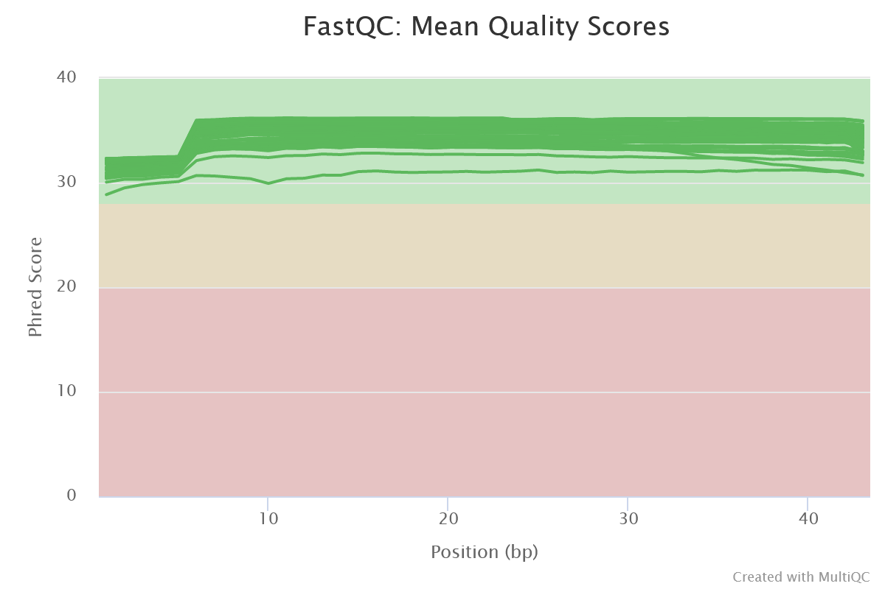

## First alignment using Salmon

The first idea for identifying cellular types based on RNAseq data was to align the reads on a reference mouse transcriptome in order to count the number of reads per genes and to be able to go further in comparisons. This alignement on transcriptome was performed with **salmon** in a two steps framework.
First a salmon index was obtained with the script `salmon_index.sh` using as reference `Mus_musculus.GRCm38.cdna.all.fa` and `mouse_index_unzipped`.

Then, the Java package **salmon** xas run on all the cells with `alignment.sh`

## Analysis of the data with Seurat

The R package Seurat permits to conduct statistical analysis on single cell data and more information about the code are in the R script `Seurat_treatment.R`. The analysis follows the guideline of the [Seurat tutorial](https://satijalab.org/seurat/v3.2/pbmc3k_tutorial.html). 
In this work the data used have been produced by STAR alignement which is described bellow and in this part only the spliced RNA were considered. To see the results with **salmon** please see Guillaume work [here](https://github.com/guiseuzaret/tp_ngs_single_cell)

### Purification on gene counts

With the precise number of counts per genes a more precise purification can be run on the dataset. The three following values were used as reference of sequencing quality and a threshold was set on those values to ensure the consistence of the data.

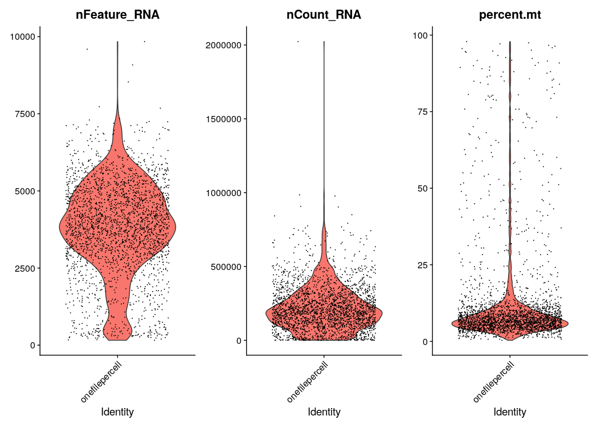 

* Total number of reads: remove the lowest and highest 5%
* Number of different genes: remove the lowest 5%
* Percent of motochondrial RNA: only cells with less than 15% of mitochondrial RNA were kept.

1962 cells corresponded to these criteria and the Fig testifies that extreme values have been removed.

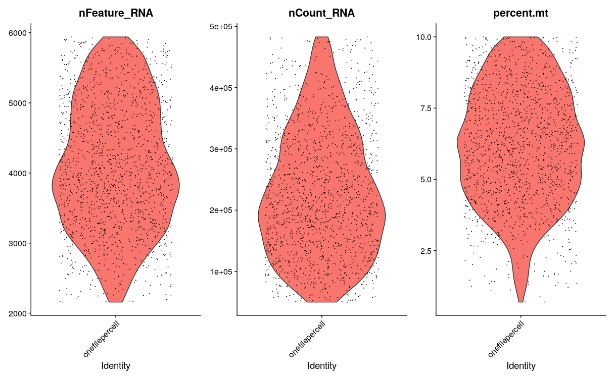

### Estimating variance of the Dataset and rescaling the data

As the following analysis aim to detect different cell type it is important to select genes that exhibit variability in their expression. Based on the Fig, the 5% more expressed genes were selected. This step is important because it the first dimensional reduction of our data and it will prevent some bias for the next dimensional reductions. A lot of poorly variable genes will have a deleterious impact on the PCA because it will increase sparsity and introduce correlated variables that are not consistent with the goal of this work.

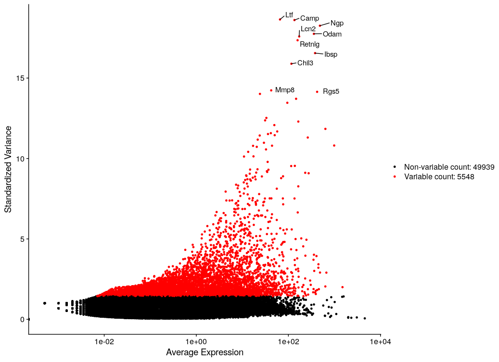

### Dimensional reduction

After the previous purification steps the dataset was still high dimension (5548 genes on 1962 cells) and then non usable for clustering algorithms. For this reason a PCA method was run on the data using Seurat. 

The principle of the PCA is to aggregate dimension that explain the biggest parts of the variance. Then, the issue is to determine how many dimension would have the reducted subspace. If the chosen dimension is too low there will be information loss and on the contrary if its too high the benefits of the operation would be null. In order to determine the right number of dimensions, three methods can be used to estimate the importance of each reducted dimension.

The first option is to make heatmaps of the variation of genes on the interest principal component. As illustrated bellow the first component's heatmap exhibits clear correlations whereas the 20th does not.

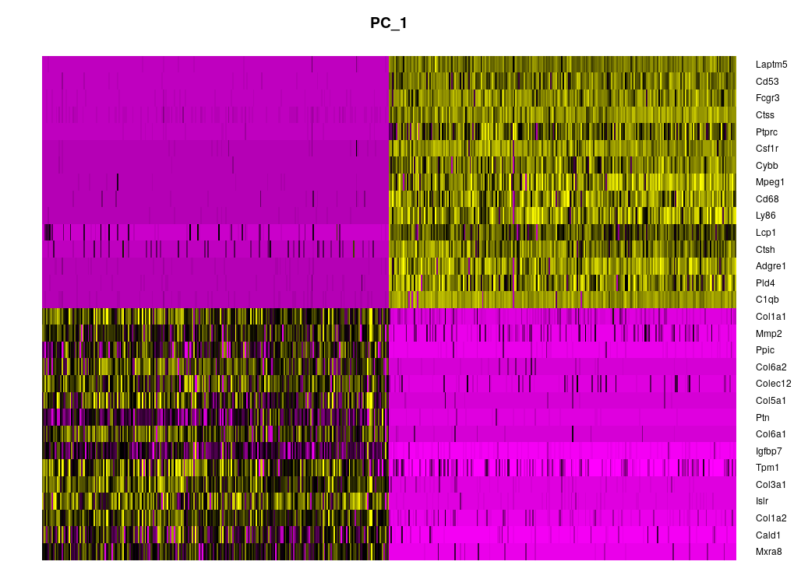

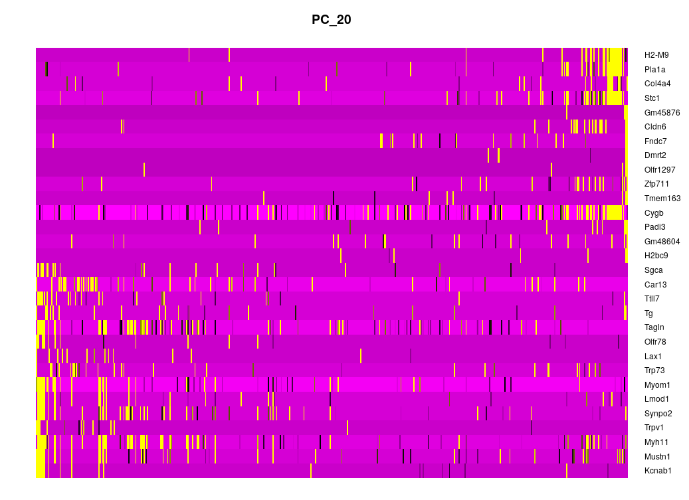

But their is a grey zone between 10th and 20th components so it is hard to chose which one is no more interesting.

The second method is to plot the cumulated explained variance across the principal commponents in an Elbowplot:

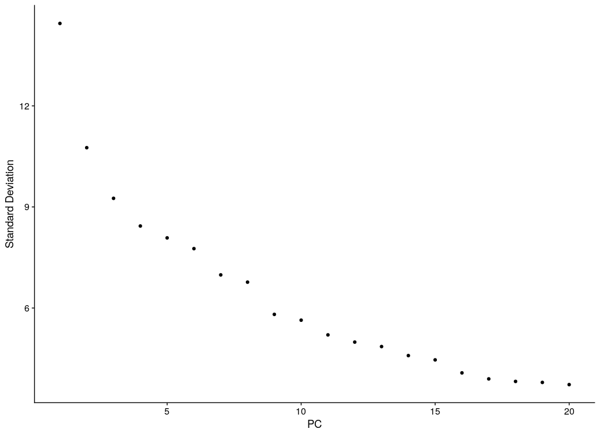

Once again, it is not clear when the compenent are no more relevant to consider. 
The third and last option is to consider the null hypothesis of repartition of the data and to plot the principal component against this hypothesis. (Dashed line in the figure below):

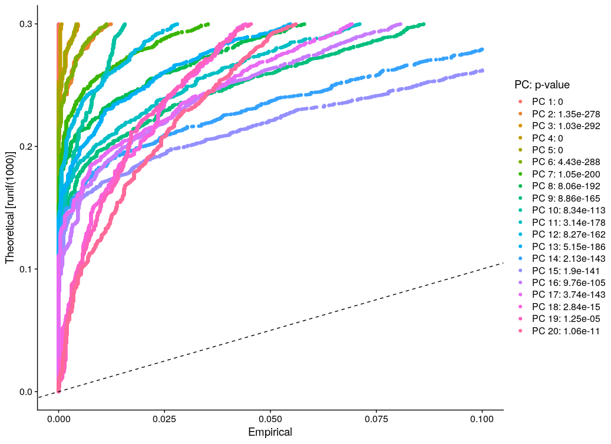

This three approaches gives an illustration of how tough the choice of the number of relevant components can be. However, it is important to remember that this question has no answer and depends on the objectives of the study. Considering more components is prone to increase the computational cost and sometimes the benefits are tiny in comparison.

As it will be discussed in the part about clustering, PCA presents some weakness in terms of display (the clusters tend to overlap and for the machine it is not an issue but it make the figure looks strange). To overcome this issue, non-linear dimension reduction methods are particularly relevant. The two most common no-linear dimension reduction methods are implemented in **Seurat**. The following figure illustrate the influence of the main **Umap** parameter: perplexity. This parameter control the trade-off between conservation of data's local organization and global structure of the dataset. 
Because of the computational cost both  **umap** and **t-sne** were run on the first 20 PC obtained just before.

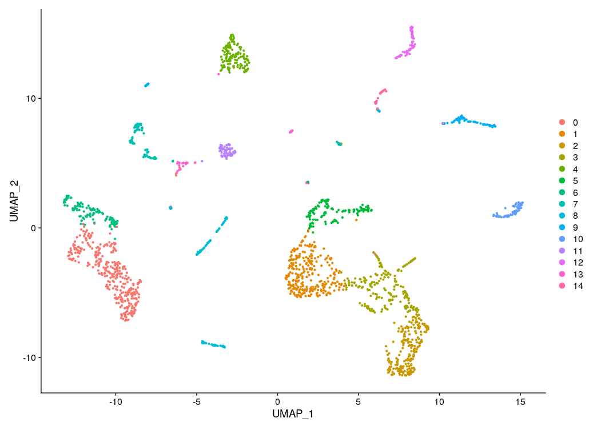
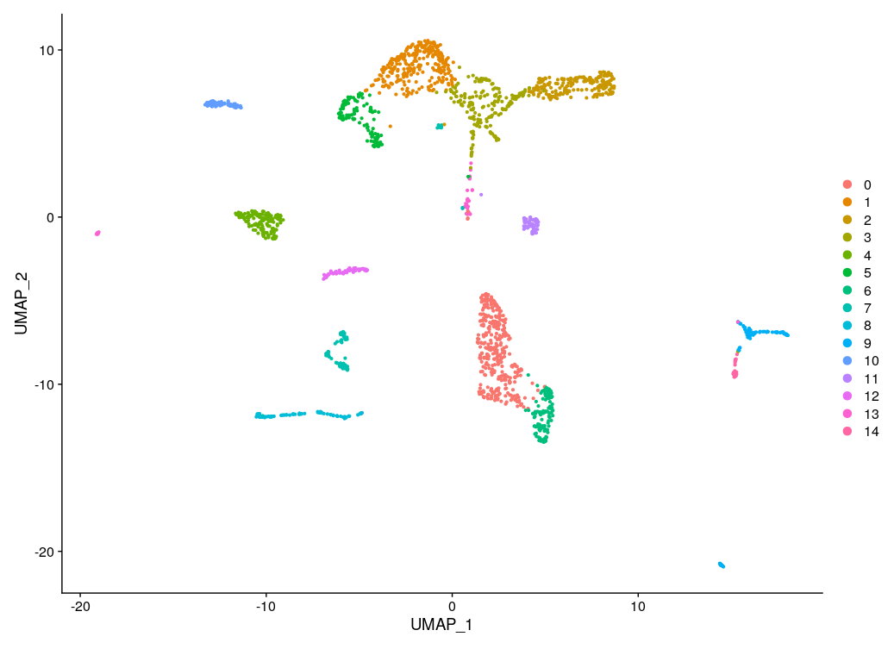
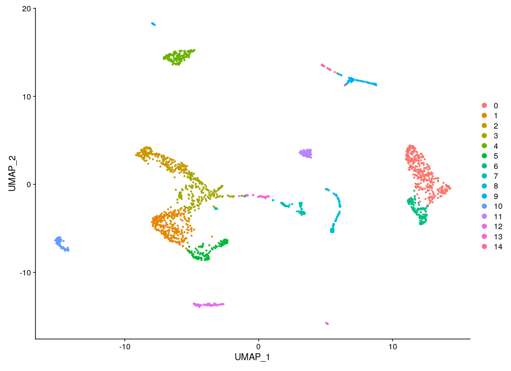

With perplexity=10 the representation is sparse with a wide diversity of clusters and with perpelexity>30 some clusters are merged whereas the identified cell types are different (see **clustering** and **annotation** parts).

### Clustering

The clustering method aims to group cells by types in function of their RNA expression. Here the method used is derived from Louvain modularity maximization. First the neighborhood of each cell was compute then the clustering method was run The expected results where obtained by comparing the result of 
### Annotation of the clusters

## Toward RNA velocity 1: Functionment of the method and alignement on the whole genome
The aim of the RNA velocity analysis is to add a time dimension to the RNA seq study. It works by comparing the ration of spliced and unspliced RNA as illustrated in the figure bellow. Then, the ratio are analysed with regard to a simplist model of transcription and traduction dynamics. This very basic model suggests that there should proportionally be more unspliced RNA than spliced when the gene start being expressed. Conversly when the gene is no more expressed the ratio should be positive for spliced RNA. (See figure below from [La Manno, G., Soldatov, R., Zeisel, A. et al. RNA velocity of single cells. Nature 560, 494–498 (2018)]( https://doi.org/10.1038/s41586-018-0414-6)).

The spliced counts are detected if they carry sequences that are not continuous in the genome. For this reason, an alignment on the whole genome with anotations on intronic and exonic sequences is need. To this purpose, the library [STAR](https://hbctraining.github.io/Intro-to-rnaseq-hpc-O2/lessons/03_alignment.html) was used. As for salmon STAR require an index. Here the selected reference genome can be downloaded at ( ftp://ftp.ensembl.org/pub/release-101/fasta/mus_musculus/dna/Mus_musculus.GRCm38.dna.primary_assembly.fa.gz) and the anotations can be found at (ftp://ftp.ensembl.org/pub/release-101/gtf/mus_musculus/Mus_musculus.GRCm38.101.gtf.gz).
The index was built with those two files and the script `STAR_index.sh`. Afterward, the script `run_STAR.sh` was executed on the purified data. 

## Toward RNA velocity 2: Sorting the counts and creating the loom file

Due to the shape of the dataset (too many different cells in different files), the sorting method implemented inside of STAR was not usable. Thus the **samtool** sorting method was used with the script `samtoolsort.sh`. This step is mandatory for creating the loomfile the will be used for the final step of the analysis. The loomfile is a format distinguishing spliced, unspliced and ambiguous counts.

## Toward RNA velocity 3: Vizualizing velocity and identifying genes prone to explain it

The codes are available at the end of the R script `Seurat_treatment.R`. The first one was inspired by the **Velocito.R** [tutorial](http://pklab.med.harvard.edu/velocyto/notebooks/R/DG1.nb.html). The second one was given by the work supervisors. 

## Conclusion

